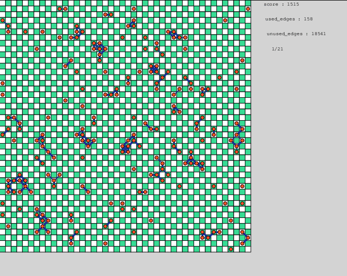

# Hokkaido Univ.& Hitachi 1st New-concept Computing Contest 2017 ビジュアライザ

Hokkaido Univ.& Hitachi 1st New-concept Computing Contest 2017 のビジュアライザです。
練習のために作りました。
当プログラムを使用したことによって生じたいかなる損害に対しても責任を負いません。

## 使い方
### できること
- 結果をビジュアライズできます。
- 最終結果だけでなく、途中経過も出力すれば見られます。
    -- 出力方法は、最終結果と同じ形式でn個出力するだけです。
- gifアニメで保存もできます。

### 実行
- コンテストページからproblem1_toolkit_JPをダウンロードしてHHMM2017firstVisの中におきます。
- HHMM2017firstVis/probrem1_toolkit_JP/scriptsディレクトリ内でgraph_generator.cppをgraph_generator.outというファイル名でコンパイルします。
- srcディレクトリに実行ファイル（コンテストと同じ形式で入力を受け取って、出力を返すもの）をmain.outというファイル名でおきます。（すでにあるものを置き換えてください）
- HHMM2017firstVisディレクトリに移動し、"python3 Main.py [graphclass] [seed]"で実行します。

### 結果をgifアニメで保存する
- saveボタンを押すと、saveディレクトリに実行結果をcanvas_anime.gifというファイル名で保存します。
    -- psファイルからgifへの変換にconvertコマンドを利用しているので、Shellでconvertコマンドを利用できるようにしておいてください。
        --- もっといいやり方を知っている人がいたら教えてください。